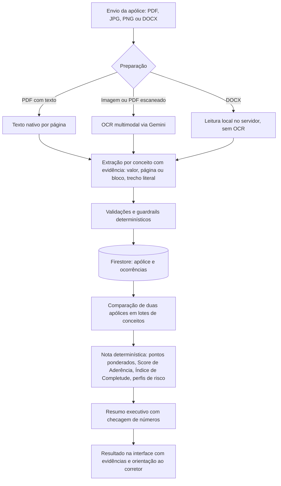

# ClauseAI

Plataforma para análise e comparação de apólices D&O com IA generativa, desenvolvida como Projeto Final do Instituto de Inteligência Artificial Aplicada (I2A2). Entrega: 06/10/2026.

- Aplicação: [clauseai-phi.vercel.app](https://clauseai-phi.vercel.app) (frontend) e [clauseai-k1zq.onrender.com/health](https://clauseai-k1zq.onrender.com/health) (API).
- Documentação técnica (fonte de verdade): [`docs/`](docs/README.md).
- Artefatos de entrega: [`Projeto_Final_Artefatos/`](Projeto_Final_Artefatos/README.md).

## O que é

O ClauseAI é um MVP que recebe apólices D&O em PDF, imagem (JPG, PNG) ou DOCX, extrai cláusulas e coberturas com evidência literal e compara duas apólices conceito a conceito. A comparação aceita PDF × PDF, DOCX × DOCX e PDF × DOCX.

O princípio do sistema é: **a IA interpreta, mas não decide sozinha**.

- A IA (Gemini) lê o documento, localiza conceitos e propõe avaliações dentro de escalas fechadas.
- Regras determinísticas no backend validam cada saída, calculam todas as notas e conferem o resumo.
- Todo resultado mostra o trecho literal, a cláusula e a página (ou o bloco, no DOCX) de origem.
- Quando a informação é ambígua, incompleta ou não comprovada, o sistema orienta: "Consulte seu corretor de seguros."

As regras de negócio estão em [`docs/domain/DO_KNOWLEDGE_BASE.md`](docs/domain/DO_KNOWLEDGE_BASE.md).

## Tecnologias

| Camada | Tecnologias |
|---|---|
| Frontend | React, TypeScript, Vite, SCSS |
| Backend | Python 3.12, FastAPI, Uvicorn |
| Dados | Firebase Firestore |
| Arquivos originais | Pasta local (padrão) ou Firebase Storage |
| Identidade | Firebase Anonymous Auth (uma identidade por navegador) |
| IA | Gemini 3.5 Flash Lite (`gemini-3.5-flash-lite`) em extração, OCR, avaliação por conceito e resumo |
| Qualidade | Ruff, mypy, pytest, ESLint, Prettier, Vitest |
| CI/CD | GitHub Actions, Render (backend), Vercel (frontend) |

## Arquitetura

Monólito modular com Clean Architecture (ADR-001, ADR-011):

```text
presentation -> application -> domain
infrastructure -> interfaces de application/domain
```

| Camada | Responsabilidade |
|---|---|
| `domain` | Entidades, regras invioláveis, guardrails, pontuação e checagem do resumo. Não importa FastAPI, Firebase nem Gemini. |
| `application` | Casos de uso (envio, processamento, comparação) e publicação de eventos. |
| `infrastructure` | Adaptadores: Gemini, leitor de PDF, leitor de DOCX, Firestore, armazenamento, Event Bus, base de conhecimento. |
| `presentation` | Rotas FastAPI, autenticação e mapeamento de erros. |

O processamento é assíncrono: a API responde `202` e um worker interno consome uma fila em memória (`QueuedEventBus`, ADR-021). Detalhes em [`docs/architecture/ARCHITECTURE_OVERVIEW.md`](docs/architecture/ARCHITECTURE_OVERVIEW.md).

### Fluxo de processamento



### Números verificáveis

| Item | Valor | Onde |
|---|---|---|
| Conceitos D&O na base de conhecimento | 44 (31 com peso técnico) | `backend/app/infrastructure/knowledge_base/knowledge_base.json` |
| Páginas de texto por chamada de extração | 30 | `extraction_pages_per_call` em `backend/app/shared/config/settings.py` |
| Conceitos por chamada de avaliação | 10 | `assessment_batch_size` |
| Tentativas por chamada de IA (falha transitória ou formato inválido) | até 3 | `ai_max_attempts` |
| Retenção de cada apólice | 24 h após o envio | `retention_hours` |
| Tamanho máximo por arquivo | 20 MB | `max_upload_mb` |

Respostas de limite de uso do Gemini (HTTP 429) esperam o tempo pedido pelo provedor, com orçamento próprio, e não contam como tentativa.

### Guardrails sobre a saída da IA

Implementados em `backend/app/domain/services/guardrails.py` e `conclusion_guard.py`:

- Classificação sem trecho literal vira "não comprovado".
- Menção em documento não contratual (por exemplo, Condições Gerais) não prova contratação e vira "não comprovado".
- "Não comprovado" limita o Resultado-base a 0,25. "Não localizado" e "Excluído" valem 0.
- Valores fora das escalas são arredondados ao degrau permitido. Redução sem justificativa recebe confiança baixa.
- Trecho citado que não aparece no texto nativo da página tem a confiança reduzida.
- IDs de conceito fora do catálogo são descartados.
- O resumo executivo que traz número ausente dos fatos calculados, ou aponta vencedor único numa decisão condicionada, é trocado pela conclusão determinística.

### Justificativas arquiteturais

| Decisão | Motivo | ADR |
|---|---|---|
| Monólito modular | Menos operação para uma equipe pequena; módulos testáveis isoladamente | ADR-001 |
| Comparação determinística + avaliação por IA | Separa fatos de interpretação; notas reproduzíveis | ADR-009, ADR-018 |
| Gemini em todas as etapas | O plano gratuito do Groq não comportava uma comparação completa; uma chave e uma integração | ADR-023 (substitui ADR-007) |
| Leitura nativa de PDF e OCR só quando necessário | Texto exato e menor custo | ADR-019 |
| DOCX lido localmente | Sem erro de OCR e sem custo de modelo na leitura | ADR-024 |
| Base de conhecimento versionada | Catálogo, pesos e perfis fora do código e dos prompts | ADR-017 |
| Eventos internos e worker em fila | API responsiva sem infraestrutura externa | ADR-012, ADR-021 |
| Arquivos em pasta local por padrão | Funciona no plano gratuito do Firebase | ADR-022 |
| Isolamento anônimo por navegador | Visitantes não veem dados uns dos outros, sem cadastro | ADR-027 |
| Retenção de 24 h | Exposição mínima de dados (LGPD) | ADR-028 |

Todas as decisões estão em [`docs/adrs/ADRS.md`](docs/adrs/ADRS.md).

## Segurança e governança

- **Prompt injection.** O documento é delimitado e declarado como dado. O texto da apólice não altera instruções, schema nem modelo. Toda saída passa por validação de schema e pelos guardrails ([`docs/AI_SYSTEM_SPEC.md`](docs/AI_SYSTEM_SPEC.md), seção 10).
- **Prompts versionados.** Ficam em `backend/app/infrastructure/ai/prompts/` (`P-SYSTEM-001`, `P-EXTRACT-001`, `P-ASSESS-001`, `P-EXECUTIVE-001`). A versão do prompt é gravada com cada extração.
- **Logs.** Nunca registram chave de API, token, nome de arquivo, seguradora, texto extraído nem apólice integral. O dono aparece como hash curto (`owner_ref`).
- **Isolamento.** Cada navegador recebe uma identidade anônima do Firebase. Toda rota em `/api/v1` exige token, e cada consulta filtra pelo dono. Recurso de outro dono responde `404`. Há cotas por navegador (ADR-027).
- **Retenção (LGPD).** Cada apólice expira 24 h após o envio, sem renovação. Uma varredura periódica apaga dados e arquivos vencidos, e nenhuma leitura retorna item expirado. O usuário pode apagar tudo na hora em "Privacidade e dados" (ADR-028).
- **Modo local de IA.** `AI_PROVIDER=local` usa regras determinísticas sem chamar modelo, só para desenvolvimento. É recusado com `APP_ENV=production` (ADR-026).
- **Segredos.** Somente em variáveis de ambiente. O `.env` não é versionado.

## Agentes

### No produto

Os agentes sugeridos pelo desafio (recepção, OCR/extração, cláusulas, estruturação, comparação e relatório) são serviços do monólito com prompt versionado e contrato próprio, orquestrados pelo Event Bus interno (ADR-020). O Quality Gate confere o checklist antes de concluir a comparação.

### No desenvolvimento

O sistema foi construído com uma equipe de subagentes do Claude Code, definidos em [`.claude/agents/`](.claude/agents/):

| Agente | Função |
|---|---|
| `ux-ui-norman` | Experiência do usuário na linha de Don Norman. Entrega decisões, não código. |
| `interface-designer` | Fontes, cores, tokens e remake visual. Mantém as cores de notificação. |
| `frontend-specialist` | React/TypeScript seguindo UX, Interface, Clean Code, SOLID, eventos e SDD. |
| `backend-specialist` | FastAPI, extração PDF/DOCX e comparação, com SOLID, Clean Code, eventos e SDD. |
| `software-engineer-docs` | Atualiza `docs/` a cada decisão da equipe. |
| `qa` | Fecha arestas, escreve testes e valida o fluxo completo. |
| `devops` | CI/CD, commits, PR, merge e deploy, somente quando solicitado. |

Fluxo de trabalho: `ux-ui-norman` decide, `interface-designer` e `frontend-specialist` implementam, `backend-specialist` entrega a API, `software-engineer-docs` documenta, `qa` valida e `devops` publica. O desenvolvimento segue SDD: a spec e o ADR vêm antes ou junto do código.

## Apólices de exemplo e fontes

A pasta [`Policy/`](Policy/) tem 5 apólices D&O **fictícias**, cada uma em PDF e DOCX com o mesmo conteúdo:

| Arquivo | Perfil |
|---|---|
| `01_Aurelius_DO_Energia_Capital_Aberto` | Energia, companhia aberta |
| `02_Boreal_DO_Industria_Capital_Fechado` | Indústria, capital fechado |
| `03_Cerrado_DO_Agronegocio` | Agronegócio, capital fechado |
| `04_Delfos_DO_Tecnologia` | Tecnologia (SaaS) com filiais nos EUA |
| `05_Fenix_Austral_DO_Financeiro` | Instituição financeira, companhia aberta |

Empresas, seguradoras, números de apólice, processos SUSEP e pessoas são inventados e não têm valor contratual. Cada apólice tem diferenças propositais (retroatividade, prazos, território, exclusões, sublimites) para a comparação ter o que mostrar. Elas são geradas de forma reprodutível por `backend/scripts/generate_sample_policies.py`, a partir de `backend/scripts/sample_policies/catalog.py`. A tabela completa de diferenças está em [`docs/development/getting-started.md`](docs/development/getting-started.md).

As bases de negócio que definem conceitos, pesos e comportamento da IA estão em [`docs/domain/sources/`](docs/domain/sources/):

- `01_matriz_equivalencia_dicionario_do.xlsx`: conceitos-base, variantes e regras de extração.
- `02_pesos_analise_decisao_apolice.docx`: importância, pesos, escalas, scores e pareceres.
- `03_prompts_agente_comparador_apolice.docx`: comportamento da IA em cada etapa.

## Como executar

### Requisitos

- Python 3.12 ou superior.
- Node.js 20.19 ou superior e npm.
- Git.

### Backend

```powershell
cd backend
python -m venv .venv
.\.venv\Scripts\Activate.ps1
python -m pip install -e ".[dev]"
Copy-Item .env.example .env
python -m uvicorn app.main:app --reload
```

Verifique `http://localhost:8000/health`.

### Frontend

Em outro terminal:

```powershell
cd frontend
npm install
Copy-Item .env.example .env
npm run dev
```

Abra `http://localhost:5173`.

### Configuração

Preencha `backend/.env` com a chave do Gemini e as credenciais do Firebase (tabela em [`backend/README.md`](backend/README.md)). Sem as variáveis obrigatórias, o backend não sobe e lista o que falta.

Para rodar sem nenhuma credencial:

| Arquivo | Variáveis |
|---|---|
| `backend/.env` | `AI_PROVIDER=local`, `PERSISTENCE_BACKEND=memory`, `STORAGE_BACKEND=local`, `AUTH_BACKEND=fake` |
| `frontend/.env` | `VITE_AUTH_MODE=dev` |

Nesse modo, os resultados não têm valor de negócio. Detalhes em [`docs/development/getting-started.md`](docs/development/getting-started.md).

### Testes e qualidade

```powershell
# backend
cd backend
python -m pytest
python -m ruff check .
python -m ruff format --check .
python -m mypy app

# frontend
cd ..\frontend
npm run test:run
npm run lint
npm run format:check
npm run typecheck
npm run build
```

Os mesmos comandos rodam no CI (`.github/workflows/backend-ci.yml` e `frontend-ci.yml`). Convenções de contribuição em [`CONTRIBUTING.md`](CONTRIBUTING.md).

### Deploy

- Backend no Render, configurado por [`render.yaml`](render.yaml). Publica a `main` só depois que o CI passa.
- Frontend na Vercel, a partir de `frontend/`.
- O workflow `retention-keepalive.yml` chama `/health` de hora em hora para a varredura de retenção rodar.

Passo a passo em [`docs/development/deploy.md`](docs/development/deploy.md).

### Fluxo Git

```text
branch curta -> commit Conventional Commits -> push -> Pull Request -> CI -> squash merge
```

Não desenvolva diretamente na `main`. Veja [`docs/development/git-workflow.md`](docs/development/git-workflow.md).

## Estrutura

```text
ClauseAI/
├── backend/                  # API FastAPI, domínio, adaptadores, scripts e testes
├── frontend/                 # React/TypeScript/SCSS
├── docs/                     # specs, ADRs, arquitetura, roadmap, base de conhecimento
├── Policy/                   # apólices D&O fictícias (PDF e DOCX)
├── Projeto_Final_Artefatos/  # relatório, pitch e vídeo
├── .claude/agents/           # subagentes usados no desenvolvimento
├── render.yaml               # blueprint do backend no Render
├── CONTRIBUTING.md
└── LICENSE
```

Telas: Início, Apólices, Comparar, Conceitos, Histórico e Privacidade e dados.

## Limitações conhecidas

- **Apólices fictícias.** As de `Policy/` têm cerca de 12 páginas, menos que apólices reais. Servem para testar a comparação, não para medir desempenho em documentos longos.
- **Dependência do Gemini.** Extração, OCR e avaliação dependem da cota e da disponibilidade do Gemini. No limite de uso, o processamento espera e fica mais lento; ainda não há teto total de espera por tarefa.
- **Retenção de 24 h.** O usuário precisa comparar no mesmo dia do envio. Os dados ficam ligados ao navegador: outro navegador ou aparelho não vê as apólices.
- **Plano gratuito do Render.** O serviço hiberna após 15 minutos sem uso (a primeira requisição leva cerca de um minuto). O disco é efêmero, então os arquivos originais somem em cada deploy ou reinício; os dados extraídos ficam no Firestore.
- **Fila e cotas em memória.** Tarefas em andamento se perdem num reinício, e o serviço roda em um único processo.
- **Cotas contornáveis.** Criar novas identidades anônimas contorna as cotas por navegador.
- **DOCX.** Numeração automática de listas e cláusulas do Word, notas de rodapé e caixas de texto não são extraídas.
- **Checagem do resumo.** Números escritos por extenso não são verificados.
- **Parâmetros de decisão.** `profile_multiplier`, `close_score_threshold` e `min_completeness` seguem `PENDING_BUSINESS_VALIDATION`.
- **Sem aconselhamento jurídico.** O resultado é uma análise condicionada e não substitui o corretor.

Lista completa e riscos aceitos em [`docs/ROADMAP.md`](docs/ROADMAP.md).

## Evolução futura

- RAG sobre o texto das apólices e as bases de negócio para apoiar a interpretação.
- Integração com bases reais de seguradoras.
- Painel para corretores, com revisão humana e correção assistida.
- Conjunto ampliado de apólices reais anonimizadas para testes e calibração.
- Comparação de mais de duas apólices e edição de pesos com trilha de auditoria.
- Fila durável e escala horizontal.
- Firebase App Check para proteger a identidade anônima.
- TTL nativo do Firestore como reforço da retenção.
- Leitura de numeração automática, notas de rodapé e caixas de texto no DOCX.

## Documentação

| Documento | Conteúdo |
|---|---|
| [`docs/README.md`](docs/README.md) | Índice e escopo do MVP |
| [`docs/specs/SDD_SPECIFICATIONS.md`](docs/specs/SDD_SPECIFICATIONS.md) | Specs com critérios de aceite |
| [`docs/adrs/ADRS.md`](docs/adrs/ADRS.md) | Decisões arquiteturais |
| [`docs/architecture/`](docs/architecture/) | Arquitetura, módulos, modelo de domínio, persistência e API |
| [`docs/AI_SYSTEM_SPEC.md`](docs/AI_SYSTEM_SPEC.md) | Contratos de IA, guardrails e observabilidade |
| [`docs/domain/DO_KNOWLEDGE_BASE.md`](docs/domain/DO_KNOWLEDGE_BASE.md) | Base de conhecimento D&O |
| [`docs/ROADMAP.md`](docs/ROADMAP.md) | Fases, incrementos e pendências |
| [`Projeto_Final_Artefatos/`](Projeto_Final_Artefatos/README.md) | Relatório técnico, pitch deck e vídeo |

## Equipe

- Karen Mendes Neves de Oliveira
- Julianna Rosa Del Cielo
- Giovana Arenzano da Palma Martins
- Yure Santana

## Licença

Este projeto está licenciado sob a [licença MIT](LICENSE).
