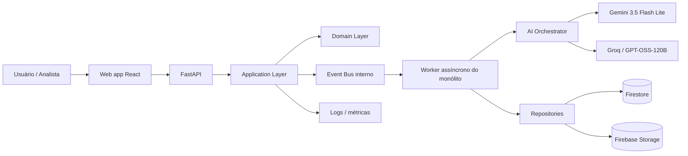
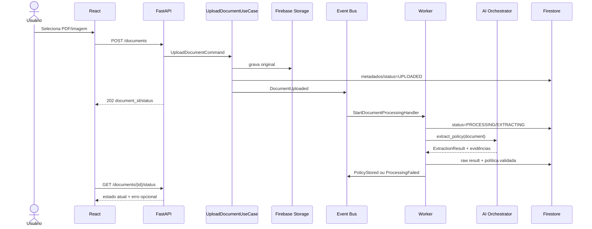
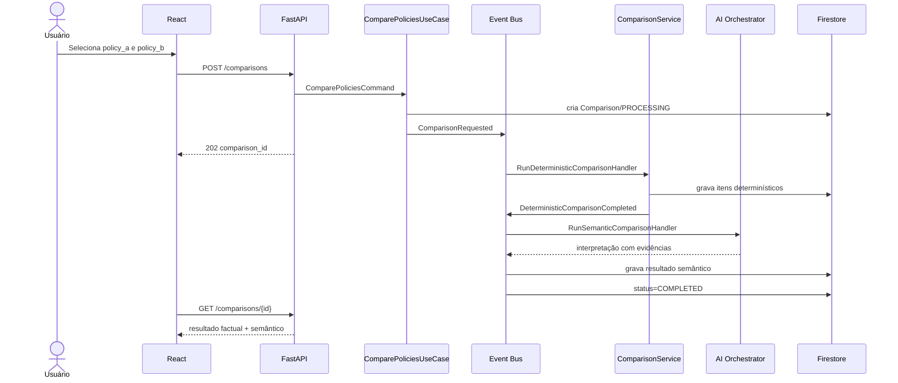

# A1 — Architecture Overview

## 1. Objetivo e escopo

O ClauseAI recebe documentos de apólice D&O, armazena o original, extrai dados estruturados com IA, valida e persiste esses dados, compara duas apólices de modo determinístico e produz uma explicação semântica rastreável. O MVP privilegia execução local simples, baixa acoplagem e capacidade de substituir provedores externos sem alterar o domínio.

### Requisitos funcionais

| ID | Requisito |
|---|---|
| RF-01 | Aceitar PDF e imagens suportadas pelo contrato de upload. |
| RF-02 | Armazenar original, metadados, status e histórico de processamento. |
| RF-03 | Processar fora do ciclo da requisição de upload. |
| RF-04 | Extrair conteúdo estruturado e evidências de origem. |
| RF-05 | Permitir consultar documentos e apólices concluídas. |
| RF-06 | Comparar exatamente duas apólices. |
| RF-07 | Exibir fatos determinísticos separados de interpretação semântica. |
| RF-08 | Expor falhas recuperáveis, correlação e status do processamento. |

### Requisitos não funcionais

- **Simplicidade:** monólito modular, uma base de código, Event Bus em memória e um processo de worker no MVP.
- **Rastreabilidade:** cada valor extraído referencia documento, página, trecho, modelo e prompt.
- **Explicabilidade:** resultados não suportados por evidência ficam nulos ou marcados como ambíguos.
- **Resiliência:** timeout, retry limitado e estado `FAILED` explícito.
- **Segurança:** segredos apenas em variáveis de ambiente/secret manager; arquivos tratados como dados não confiáveis.
- **Testabilidade:** interfaces para storage, repositórios, relógio, IDs, IA e Event Bus.
- **Evolução:** providers, storage e barramento externo podem ser adicionados por adaptadores.

## 2. Visão de contexto



## 3. Componentes e responsabilidades

| Componente | Responsabilidade | Não deve fazer |
|---|---|---|
| React UI | Interação, estado de tela e renderização | Acessar Firebase ou providers de IA diretamente |
| FastAPI | Serializar entrada/saída, autenticar no futuro, mapear erros | Executar regra de negócio ou chamada longa de IA |
| Application | Orquestrar casos de uso, transações lógicas e publicação de eventos | Conhecer detalhes de HTTP, Firestore ou SDKs de IA |
| Domain | Entidades, value objects, invariantes e comparação determinística | Importar FastAPI, Firebase ou Gemini/Groq |
| Document Service | Validar metadados, persistir original e iniciar processamento | Interpretar cláusulas |
| Extraction Service | Coordenar extração, parsing, validação e normalização | Escolher apólice melhor |
| Policy Service | Construir e persistir estrutura de apólice | Fazer chamadas externas diretamente |
| Comparison Service | Comparação determinística e montagem do contexto semântico | Ocultar diferenças factuais |
| AI Orchestrator | Roteamento, prompts, schemas, timeout, retry, logs e providers | Ser fonte de regra de negócio |
| Repositories | Persistência por contratos pequenos | Vazar objetos do SDK para domínio |
| Event Bus | Publicar e consumir eventos internos | Ser banco de dados ou garantir entrega durável |
| Worker | Consumir eventos e executar operações demoradas | Misturar handlers ou assumir contexto global mutável |

## 4. Dependências e direção

```text
presentation -> application -> domain
infrastructure -> application/domain interfaces
shared -> usado transversalmente, sem regra de negócio
```

O domínio depende apenas de tipos e interfaces próprias. A infraestrutura implementa `DocumentRepository`, `PolicyRepository`, `ComparisonRepository`, `BlobStorage`, `AIProvider` e `EventBus`. FastAPI é um adaptador de entrada/saída.

## 5. Fluxo de processamento de apólice



## 6. Fluxo de comparação



## 7. Eventos do MVP

Todos implementam o envelope comum:

```json
{
  "event_id": "evt_01",
  "event_type": "DocumentUploaded",
  "event_version": 1,
  "occurred_at": "2026-09-20T12:00:00Z",
  "correlation_id": "cor_01",
  "entity_id": "doc_01",
  "payload": {}
}
```

| Evento | Produtor | Consumidor principal | Payload mínimo |
|---|---|---|---|
| `DocumentUploaded` | Upload use case | `StartDocumentProcessingHandler` | `document_id`, `storage_key`, `content_type` |
| `DocumentValidated` | Document handler | próximo passo do pipeline | `document_id`, `validation` |
| `DocumentProcessingStarted` | Processing handler | observabilidade/UI | `document_id`, `processing_id` |
| `ExtractionRequested` | Processing handler | `ExtractPolicyHandler` | `document_id`, `processing_id` |
| `ExtractionCompleted` | Extraction handler | `PersistPolicyHandler` | `document_id`, `extraction_result_id` |
| `ExtractionFailed` | Extraction handler | falha/retentativa | `document_id`, `error_code`, `retryable` |
| `PolicyStructured` | Validation handler | persistência | `policy_id`, `document_id`, `schema_version` |
| `PolicyStored` | Policy handler | UI/observabilidade | `policy_id`, `document_id` |
| `ComparisonRequested` | Comparison use case | determinístico | `comparison_id`, `policy_ids[2]` |
| `DeterministicComparisonCompleted` | Comparison handler | semântico | `comparison_id`, `item_count` |
| `SemanticComparisonRequested` | Determinístico | semântico | `comparison_id` |
| `SemanticComparisonCompleted` | Semântico | finalização | `comparison_id`, `interpretation_id` |
| `ComparisonCompleted` | Finalização | UI/observabilidade | `comparison_id` |
| `ProcessingFailed` | qualquer handler | UI/observabilidade | `entity_type`, `entity_id`, `error_code` |

O contrato detalhado, incluindo versionamento e idempotência, está em [`specs/SDD_SPECIFICATIONS.md`](../specs/SDD_SPECIFICATIONS.md).

## 8. Assíncrono no monólito

O endpoint devolve `202 Accepted` depois de persistir o documento e publicar `DocumentUploaded`. Um worker no mesmo repositório consome o `InMemoryEventBus`. A implementação pode começar com `asyncio.Queue` e uma tarefa de ciclo de vida do processo; a interface não deve impedir a substituição por Cloud Tasks ou outro executor no futuro.

O Event Bus em memória não é durável. Portanto, o estado mínimo é persistido antes de publicar e cada handler deve poder ser reexecutado com segurança. Se o processo cair entre publicação e consumo, um comando administrativo ou uma rotina futura poderá reenfileirar jobs `UPLOADED`/`PROCESSING`.

## 9. Decisões principais

- Monólito modular para reduzir operação e permitir desenvolvimento por uma pessoa.
- Firestore como persistência documental simples e Storage para binários.
- IA isolada por `AIOrchestrator` e portas `ExtractionProvider`/`ComparisonProvider`.
- Comparação determinística antes da semântica para separar fatos de interpretação.
- Eventos internos apenas onde há trabalho demorado ou desacoplamento real.
- Sem regra de negócio de D&O não validada pela equipe de seguros.

Ver detalhes em [`adrs/ADRS.md`](../adrs/ADRS.md).
