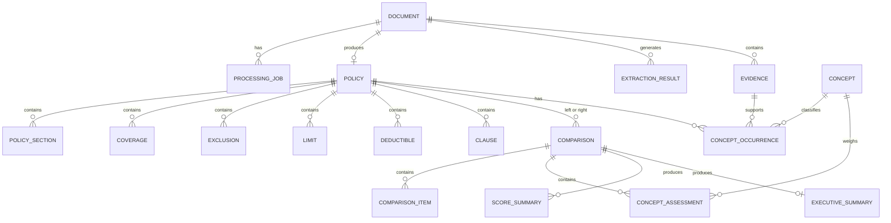

# A3 — Modelo de domínio

## 1. Convenções de modelagem

O modelo diferencia evidência extraída, ocorrência normalizada, contratação comprovada, avaliação, pontuação e recomendação (governança da [base de conhecimento](../domain/DO_KNOWLEDGE_BASE.md), seção 3). Todo campo derivado deve apontar para suas evidências ou informar que é `PENDING_BUSINESS_VALIDATION`. A ausência de informação é `null`/lista vazia com `missing_reason`; não é uma autorização para inferir.

Value objects recomendados: `DocumentId`, `PolicyId`, `ComparisonId`, `ProcessingId`, `EventId`, `CorrelationId`, `ConceptId` (`DO-NNN`), `Money`, `DateRange`, `Confidence`, `ProcessingStatus`, `ContentType`, `DocumentType`, `TechnicalWeight`, `BaseResult` (0,00/0,25/0,50/0,75/1,00), `AdjustmentFactor` (0,00/0,25/0,50/0,75/0,90/1,00), `ContractStatus`, `OccurrenceType`, `TermRelation`, `Verdict` e `RiskProfile`. Enumerações seguem a seção 4 da base de conhecimento.

## 2. Entidades

### `Document`

Representa o arquivo recebido e seus metadados.

- **Atributos:** `document_id`, `original_filename`, `content_type`, `file_kind` (`SEARCHABLE_PDF`, `SCANNED_PDF`, `IMAGE`, `OTHER`), `document_type` (`DocumentType`), `insurer?`, `policy_name?`, `policy_number?`, `issue_date?`, `validity?`, `version?`, `language?`, `size_bytes`, `checksum_sha256`, `storage_key`, `uploaded_at`, `status`, `correlation_id`, `page_count?`, `extraction_quality?`, `ocr_required`, `metadata`, `failure?`.
- Campos não identificados recebem “Não identificado” e disparam `BROKER_GUIDANCE`.
- **Responsabilidade:** garantir identidade, integridade básica, tipo permitido e ciclo do arquivo.
- **Relacionamentos:** possui zero ou mais `ProcessingJob`; origina zero ou uma `Policy` principal no MVP.
- **Estados:** `UPLOADED`, `PROCESSING`, `EXTRACTING`, `VALIDATING`, `COMPLETED`, `FAILED`.

### `Policy`

Representa a apólice estruturada, sem decidir mérito comercial ou jurídico.

- **Atributos:** `policy_id`, `document_id`, `schema_version`, `insurer`, `insured`, `policy_number?`, `validity`, `limits`, `deductibles`, `coverages`, `exclusions`, `clauses`, `source_extraction_id`, `created_at`, `updated_at`.
- **Responsabilidade:** manter uma visão estruturada e rastreável do documento.
- **Relacionamentos:** pertence a um `Document`; contém `PolicySection`, `Coverage`, `Exclusion`, `Limit`, `Deductible` e `Clause`.
- **Estados:** `DRAFT`, `VALIDATED`, `STORED`, `STALE` (quando o schema mudar).
- `insurer`, `insured`, regra de agregação de limites e semântica de cobertura ainda podem conter `PENDING_BUSINESS_VALIDATION`.

### `Evidence`

Trecho literal extraído; nunca é sobrescrito (correção gera nova versão).

- **Atributos:** `evidence_id`, `document_id`, `page`, `section_ref?`, `clause_ref?`, `literal_text`, `content_kind` (`TEXT`, `TABLE`, `IMAGE`), `extraction_method` (`NATIVE`, `OCR`, `MULTIMODAL`), `confidence`, `low_confidence`, `version`.
- **Responsabilidade:** base de rastreabilidade de todos os demais registros.

### `PolicySection`

Trecho lógico do documento, como definições, condições gerais ou endossos.

- **Atributos:** `section_id`, `name`, `section_type`, `order`, `text?`, `evidence[]`, `status`.
- **Responsabilidade:** preservar organização e contexto para auditoria/comparação.
- **Estados:** `IDENTIFIED`, `AMBIGUOUS`, `MISSING`.

### `Coverage`

Uma cobertura extraída.

- **Atributos:** `coverage_id`, `name`, `description?`, `included`, `limit_ref?`, `sublimit_ref?`, `conditions[]`, `evidence[]`, `confidence`.
- **Responsabilidade:** representar presença e escopo textual sem interpretar como recomendação.
- **Estados:** `EXTRACTED`, `AMBIGUOUS`, `UNCONFIRMED`.

### `Exclusion`

Uma exclusão extraída.

- **Atributos:** `exclusion_id`, `name?`, `text`, `applies_to?`, `exceptions[]`, `evidence[]`, `confidence`.
- **Responsabilidade:** preservar texto e exceções que influenciam a avaliação por conceito.
- **Estados:** `EXTRACTED`, `AMBIGUOUS`, `UNCONFIRMED`.

### `Limit`

Limite de responsabilidade identificado.

- **Atributos:** `limit_id`, `name`, `amount?`, `currency?`, `basis?`, `period?`, `applies_to?`, `evidence[]`, `confidence`.
- **Responsabilidade:** permitir comparação numérica quando unidade e base forem comparáveis.
- `basis` e regras de agregação: `PENDING_BUSINESS_VALIDATION`.

### `Deductible`

Franquia/participação identificada.

- **Atributos:** `deductible_id`, `name`, `amount?`, `currency?`, `percentage?`, `basis?`, `applies_to?`, `evidence[]`, `confidence`.
- **Responsabilidade:** representar valor e contexto da franquia sem converter unidades desconhecidas.
- **Estados:** `EXTRACTED`, `AMBIGUOUS`, `UNCONFIRMED`.

### `Clause`

Cláusula ou endosso textual.

- **Atributos:** `clause_id`, `title?`, `category?`, `text`, `section_ref?`, `effects?`, `evidence[]`, `confidence`.
- **Responsabilidade:** preservar linguagem contratual para a avaliação por conceito.
- **Estados:** `EXTRACTED`, `AMBIGUOUS`, `UNCONFIRMED`.
- `category` e `effects` dependem de taxonomia de seguros: `PENDING_BUSINESS_VALIDATION`.

### `Concept`

Entrada do catálogo D&O (DO-001 a DO-044), carregada da base de conhecimento versionada.

- **Atributos:** `concept_id`, `domain`, `base_concept`, `variants[]`, `model_question`, `extraction_rule`, `importance` (`CRITICAL`, `HIGH`, `MEDIUM`, `LOW`, `UNWEIGHTED`), `technical_weight?`, `weight_justification?`, `evaluation_criterion?`, `related_concepts[]`, `human_review` (`REQUIRED`, `RECOMMENDED`), `active`, `knowledge_base_version`.
- **Responsabilidade:** normalizar termos e fornecer peso e critério; não é alterado pela IA.

### `ConceptOccurrence`

Vínculo entre uma evidência e um conceito numa apólice.

- **Atributos:** `occurrence_id`, `policy_id`, `concept_id`, `evidence_ids[]`, `term_found`, `occurrence_type`, `term_relation`, `document_status`, `contract_status`, `interpretive_summary`, `alternative_concepts[]`, `confidence`, `needs_confirmation`.
- **Regra:** ocorrências que possam pertencer a mais de um conceito guardam as hipóteses em `alternative_concepts` e não são unidas.

### `ConceptAssessment`

Avaliação de um conceito para uma apólice numa comparação.

- **Atributos:** `comparison_id`, `policy_id`, `concept_id`, `contract_status`, `base_result`, `adjustment_factor`, `justification`, `evidence_ids[]`, `confidence`, `sufficient_evidence`, `weighted_points` (calculado), `broker_guidance`.
- **Regras:** justificativa obrigatória quando `base_result` ou `adjustment_factor` ≠ 1,00; exclusão expressa ⇒ pontos 0; sem dupla redução pelo mesmo motivo.

### `ScoreSummary`

Resultado numérico por apólice e perfil.

- **Atributos:** `comparison_id`, `policy_id`, `profile` (`BASE` ou `RiskProfile`), `weights_used` (base ou ajustados, com motivo), `raw_score`, `max_possible`, `adherence_score`, `documentary_score`, `completeness_index`, `critical_unconfirmed_weight`, `inconclusive_weight`, `favorable_count`, `equivalent_count`, `inconclusive_count`, `top_impact_concepts[5]`.

### `ExecutiveSummary`

Recomendação condicionada, separada da análise documental.

- **Atributos:** `summary_id`, `comparison_id`, `highest_documentary_score`, `advantages_a[]`, `advantages_b[]`, `equivalent_critical[]`, `highest_impact_differences[]`, `attention_points[]`, `profile_recommendations[]`, `decision_mode` (`TECHNICAL`, `CONDITIONED`), `score_vs_qualitative_note?`, `conclusion`, `broker_guidance`, `quality_gate`.

### `ExtractionResult`

Resultado bruto e auditável de uma execução de IA.

- **Atributos:** `extraction_result_id`, `document_id`, `model`, `provider`, `prompt_version`, `schema_version`, `raw_response_redacted?`, `parsed_payload`, `validation_errors[]`, `created_at`, `latency_ms`, `input_tokens?`, `output_tokens?`, `estimated_cost?`, `attempt`.
- **Responsabilidade:** permitir auditoria e regressão sem confundir resultado bruto com apólice validada.
- **Estados:** `REQUESTED`, `RECEIVED`, `PARSED`, `VALIDATED`, `REJECTED`.

### `Comparison`

Agrega a comparação de exatamente duas apólices.

- **Atributos:** `comparison_id`, `policy_a_id`, `policy_b_id`, `selected_profile?`, `knowledge_base_version`, `status`, `deterministic_result?`, `assessments[]`, `scores[]`, `executive_summary?`, `created_at`, `completed_at?`, `correlation_id`, `failure?`.
- **Responsabilidade:** coordenar resultado factual, avaliação, pontuação, recomendação e rastreabilidade.
- **Estados:** `REQUESTED`, `DETERMINISTIC_COMPLETED`, `ASSESSING`, `SCORED`, `SUMMARIZING`, `COMPLETED`, `PARTIAL`, `FAILED`.

### `ComparisonItem`

Diferença ou igualdade de um campo/assunto.

- **Atributos:** `item_id`, `concept_id?`, `category`, `path`, `label`, `left_value`, `right_value`, `relation`, `unit_compatible`, `evidence_left[]`, `evidence_right[]`, `main_difference?`, `verdict?`, `importance?`, `weight?`, `semantic_note?`, `confidence?`, `user_guidance?`.
- **Responsabilidade:** tornar cada comparação explicável e renderizável; corresponde a uma linha da tabela final (prompt 15).
- `relation` (fato determinístico): `EQUAL`, `DIFFERENT`, `ONLY_LEFT`, `ONLY_RIGHT`, `UNKNOWN`, `NOT_COMPARABLE`.
- `verdict` (parecer ponderado): `FAVORS_A`, `FAVORS_B`, `EQUIVALENT`, `EQUIVALENT_BOTH_EXCLUDED`, `INCONCLUSIVE`, derivado pelas regras da seção 4.6 da base de conhecimento.

### `ProcessingJob`

Execução de processamento de um documento ou comparação.

- **Atributos:** `processing_id`, `entity_type`, `entity_id`, `correlation_id`, `status`, `attempt`, `max_attempts`, `started_at?`, `finished_at?`, `last_error?`, `last_event_id?`.
- **Responsabilidade:** acompanhar execução, retry e idempotência.
- **Estados:** `PENDING`, `RUNNING`, `RETRYABLE_FAILURE`, `FAILED`, `SUCCEEDED`.

## 3. Relacionamentos

## 4. Invariantes técnicas

1. Uma comparação referencia duas apólices distintas e existentes.
2. Uma apólice persistida referencia um único documento fonte no MVP.
3. Um `ComparisonItem` não afirma igualdade quando faltam evidências suficientes.
4. `confidence` é um sinal do modelo, não uma probabilidade calibrada nem uma garantia.
5. Valores monetários preservam moeda e base; conversão cambial está fora do escopo.
6. Timestamps são UTC e gerados por `Clock` injetável.
7. Falha permanente sempre inclui código estável e `correlation_id`.
8. Upsert repetido do mesmo `processing_id` não duplica `Policy` ou `ComparisonItem`.
9. `Pontos Ponderados = Peso Técnico × Resultado-base × Fator de Ajuste`, calculado só no domínio, com `Decimal`.
10. As duas apólices de uma comparação usam o mesmo conjunto de conceitos, critérios, pesos e `knowledge_base_version`.
11. `NOT_FOUND` nunca vira `EXCLUDED` sem evidência expressa; `NOT_PROVEN` nunca vira `CONTRACTED` sem documento contratual aplicável.
12. Pesos-base são imutáveis numa comparação; perfis geram pesos ajustados com motivo registrado.
13. Com Índice de Completude abaixo do mínimo ou conceito crítico inconclusivo decisivo, a recomendação é `CONDITIONED`, nunca `TECHNICAL`.

## 5. Campos dependentes de seguros

A taxonomia de coberturas, os pesos, as escalas de pontuação, os pareceres e os perfis estão definidos na [base de conhecimento](../domain/DO_KNOWLEDGE_BASE.md). Continuam `PENDING_BUSINESS_VALIDATION`: variantes dos conceitos DO-036 a DO-044, pesos dos conceitos sem peso, multiplicador de perfil, limiares de decisão condicionada, prioridade entre limite agregado e específico, ordem de endossos e impacto de exceções. Até a validação, o sistema usa os valores propostos, sinaliza a pendência na resposta e aplica `BROKER_GUIDANCE`.
