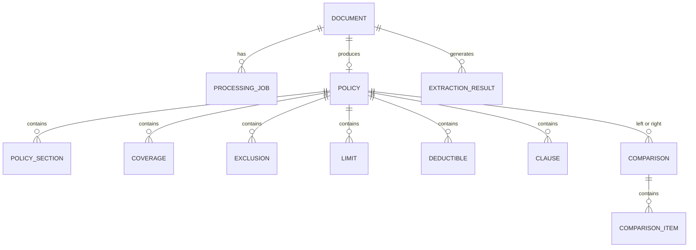

# A3 — Modelo de domínio

## 1. Convenções de modelagem

O modelo diferencia fato extraído, dado normalizado e interpretação. Todo campo derivado deve apontar para suas evidências ou informar que é `PENDING_BUSINESS_VALIDATION`. A ausência de informação é `null`/lista vazia com `missing_reason`; não é uma autorização para inferir.

Value objects recomendados: `DocumentId`, `PolicyId`, `ComparisonId`, `ProcessingId`, `EventId`, `CorrelationId`, `Money`, `DateRange`, `Evidence`, `Confidence`, `ProcessingStatus` e `ContentType`.

## 2. Entidades

### `Document`

Representa o arquivo recebido e seus metadados.

- **Atributos:** `document_id`, `original_filename`, `content_type`, `size_bytes`, `checksum_sha256`, `storage_key`, `uploaded_at`, `status`, `correlation_id`, `page_count?`, `metadata`, `failure?`.
- **Responsabilidade:** garantir identidade, integridade básica, tipo permitido e ciclo do arquivo.
- **Relacionamentos:** possui zero ou mais `ProcessingJob`; origina zero ou uma `Policy` principal no MVP.
- **Estados:** `UPLOADED`, `PROCESSING`, `EXTRACTING`, `VALIDATING`, `COMPLETED`, `FAILED`.

### `Policy`

Representa a apólice estruturada, sem decidir mérito comercial ou jurídico.

- **Atributos:** `policy_id`, `document_id`, `schema_version`, `insurer`, `insured`, `policy_number?`, `validity`, `limits`, `deductibles`, `coverages`, `exclusions`, `clauses`, `source_extraction_id`, `created_at`, `updated_at`.
- **Responsabilidade:** manter uma visão estruturada e rastreável do documento.
- **Relacionamentos:** pertence a um `Document`; contém `PolicySection`, `Coverage`, `Exclusion`, `Limit`, `Deductible` e `Clause`.
- **Estados:** `DRAFT`, `VALIDATED`, `STORED`, `STALE` (quando o schema mudar).
- `insurer`, `insured`, regra de agregação de limites e semântica de cobertura ainda podem conter `PENDING_BUSINESS_VALIDATION`.

### `PolicySection`

Trecho lógico do documento, como definições, condições gerais ou endossos.

- **Atributos:** `section_id`, `name`, `section_type`, `order`, `text?`, `evidence[]`, `status`.
- **Responsabilidade:** preservar organização e contexto para auditoria/comparação.
- **Estados:** `IDENTIFIED`, `AMBIGUOUS`, `MISSING`.

### `Coverage`

Uma cobertura extraída.

- **Atributos:** `coverage_id`, `name`, `description?`, `included`, `limit_ref?`, `sublimit_ref?`, `conditions[]`, `evidence[]`, `confidence`.
- **Responsabilidade:** representar presença e escopo textual sem interpretar como recomendação.
- **Estados:** `EXTRACTED`, `AMBIGUOUS`, `UNCONFIRMED`.

### `Exclusion`

Uma exclusão extraída.

- **Atributos:** `exclusion_id`, `name?`, `text`, `applies_to?`, `exceptions[]`, `evidence[]`, `confidence`.
- **Responsabilidade:** preservar texto e exceções que influenciam comparação semântica.
- **Estados:** `EXTRACTED`, `AMBIGUOUS`, `UNCONFIRMED`.

### `Limit`

Limite de responsabilidade identificado.

- **Atributos:** `limit_id`, `name`, `amount?`, `currency?`, `basis?`, `period?`, `applies_to?`, `evidence[]`, `confidence`.
- **Responsabilidade:** permitir comparação numérica quando unidade e base forem comparáveis.
- `basis` e regras de agregação: `PENDING_BUSINESS_VALIDATION`.

### `Deductible`

Franquia/participação identificada.

- **Atributos:** `deductible_id`, `name`, `amount?`, `currency?`, `percentage?`, `basis?`, `applies_to?`, `evidence[]`, `confidence`.
- **Responsabilidade:** representar valor e contexto da franquia sem converter unidades desconhecidas.
- **Estados:** `EXTRACTED`, `AMBIGUOUS`, `UNCONFIRMED`.

### `Clause`

Cláusula ou endosso textual.

- **Atributos:** `clause_id`, `title?`, `category?`, `text`, `section_ref?`, `effects?`, `evidence[]`, `confidence`.
- **Responsabilidade:** preservar linguagem contratual para comparação semântica.
- **Estados:** `EXTRACTED`, `AMBIGUOUS`, `UNCONFIRMED`.
- `category` e `effects` dependem de taxonomia de seguros: `PENDING_BUSINESS_VALIDATION`.

### `ExtractionResult`

Resultado bruto e auditável de uma execução de IA.

- **Atributos:** `extraction_result_id`, `document_id`, `model`, `provider`, `prompt_version`, `schema_version`, `raw_response_redacted?`, `parsed_payload`, `validation_errors[]`, `created_at`, `latency_ms`, `input_tokens?`, `output_tokens?`, `estimated_cost?`, `attempt`.
- **Responsabilidade:** permitir auditoria e regressão sem confundir resultado bruto com apólice validada.
- **Estados:** `REQUESTED`, `RECEIVED`, `PARSED`, `VALIDATED`, `REJECTED`.

### `Comparison`

Agrega a comparação de exatamente duas apólices.

- **Atributos:** `comparison_id`, `policy_a_id`, `policy_b_id`, `status`, `deterministic_result?`, `semantic_result?`, `created_at`, `completed_at?`, `correlation_id`, `failure?`.
- **Responsabilidade:** coordenar resultado factual, interpretação e rastreabilidade.
- **Estados:** `REQUESTED`, `DETERMINISTIC_COMPLETED`, `SEMANTIC_PROCESSING`, `COMPLETED`, `FAILED`.

### `ComparisonItem`

Diferença ou igualdade de um campo/assunto.

- **Atributos:** `item_id`, `category`, `path`, `label`, `left_value`, `right_value`, `relation`, `unit_compatible`, `evidence_left[]`, `evidence_right[]`, `semantic_note?`, `confidence?`.
- **Responsabilidade:** tornar cada comparação explicável e renderizável.
- `relation`: `EQUAL`, `DIFFERENT`, `ONLY_LEFT`, `ONLY_RIGHT`, `UNKNOWN`, `NOT_COMPARABLE`.
- `category` e impacto não devem ser tratados como regra jurídica sem validação.

### `ProcessingJob`

Execução de processamento de um documento ou comparação.

- **Atributos:** `processing_id`, `entity_type`, `entity_id`, `correlation_id`, `status`, `attempt`, `max_attempts`, `started_at?`, `finished_at?`, `last_error?`, `last_event_id?`.
- **Responsabilidade:** acompanhar execução, retry e idempotência.
- **Estados:** `PENDING`, `RUNNING`, `RETRYABLE_FAILURE`, `FAILED`, `SUCCEEDED`.

## 3. Relacionamentos

## 4. Invariantes técnicas

1. Uma comparação referencia duas apólices distintas e existentes.
2. Uma apólice persistida referencia um único documento fonte no MVP.
3. Um `ComparisonItem` não afirma igualdade quando faltam evidências suficientes.
4. `confidence` é um sinal do modelo, não uma probabilidade calibrada nem uma garantia.
5. Valores monetários preservam moeda e base; conversão cambial está fora do escopo.
6. Timestamps são UTC e gerados por `Clock` injetável.
7. Falha permanente sempre inclui código estável e `correlation_id`.
8. Upsert repetido do mesmo `processing_id` não duplica `Policy` ou `ComparisonItem`.

## 5. Campos dependentes de seguros

Os seguintes pontos devem ser validados antes de codificar regras de classificação: taxonomia de coberturas, tratamento de sublimits, prioridade entre limite agregado e específico, unidade de franquia, interpretação de “defesa”, “investigação”, “multas”, “Side A/B/C”, ordem de endossos, impacto de exceções e significado de termos equivalentes. Até lá, o sistema conserva texto, valores e evidências e marca interpretação como `PENDING_BUSINESS_VALIDATION`.
